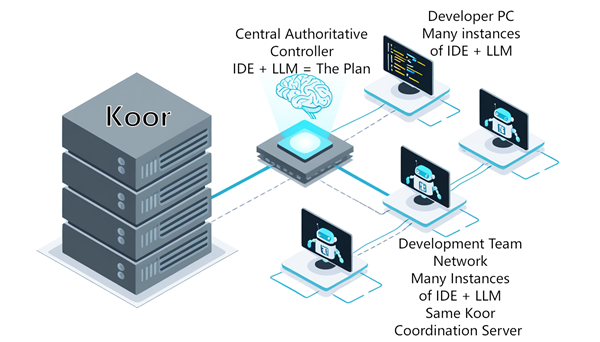

# Koor

Koor is a **coordination server** for AI coding agents — infrastructure, not a framework. Like Redis for caching, Koor provides shared state, specs, and events for any LLM agent that can speak REST or MCP. It's agnostic to IDE, LLM provider, and language.

Koor splits **control** (MCP, thin discovery layer) from **data** (REST + CLI, direct access), solving the MCP Token Tax Problem — where all coordination data gets routed through the LLM context window, burning tokens on data the LLM doesn't need to reason about.

## Why Koor Exists

I wanted a programmatic API for IDE LLM coding agents — an external system that can send prompts to, and receive structured responses from, running IDE agents.

The key to effective AI coding is keeping the context window small, so I run an LLM on each of my codebases at project level: one for frontend, one for backend, plus test projects and reference projects — up to 12 or so open at once. I use Cursor, Kilo Code, Claude Code, Antigravity, and others, checking each out for their strengths and weaknesses.

I found myself copying and pasting between IDEs and getting lost. So I built the first version of this app: **MCP-ChattTeam** — a set of workarounds for missing Claude Code APIs, trying to get multiple LLM instances to coordinate across IDEs via MCP hubs, WebSocket bridges, and file watchers.

Then Anthropic shipped Agent SDK and Agent Teams, solving ~80% of the problem natively. The remaining 20% — cross-IDE, cross-LLM, shared state — needed a different architecture. That became Koor.

The architecture centres on a **central authoritative controller** — a documentation-level LLM that doesn't write code itself but orchestrates the project-level IDE LLM instances as a central authority. Each coding agent connects to Koor via MCP regardless of IDE or LLM provider, and the controller coordinates their work through shared state, specs, and events.

**Koor helps everyone stay on plan, conform to the same rules, and stay in sync with each other.**

- **Stay on plan** — specs define scope so each agent knows what to work on
- **Contained to their part** — agents stay scoped to their own project/codebase
- **Conform to the same rules** — validation rules enforce consistency across all agents
- **Stay in sync** — agents share state (API contracts, configs) so they don't diverge from each other
- **Stay aware** — events let agents know what others have done (e.g. "backend changed the API schema")
- **Find each other** — instance discovery so agents know who else is working

The developer is released from remembering what, where, and when — and instead becomes a critic and a system-wide designer.

Furthermore, the developer is free to become an AI slop generator! Conducting countless little test-and-learn, look-see experiments — that's more apps, more files, more for a human to get lost in forgetting the reasons why? But the central controller knows what fits where, and eventually every aspect will converge into a bucket of worth and a bucket of valuable history.



## What's Genuinely New

Koor combines coordination + shared specifications + cross-LLM + standalone binary. As of February 2026, no single system covers all five:

| System | Coordination | Shared State | Shared Specs | Cross-LLM | Standalone |
|--------|:---:|:---:|:---:|:---:|:---:|
| Claude Agent Teams | Yes | No | No | No | No |
| Claude-Flow | Yes | Yes | No | No | No |
| LangGraph | Yes | Yes | No | No | No |
| AutoGen | Yes | Yes | No | No | No |
| A2A Protocol | Yes | No | No | Yes | No |
| MCP Gateways | No | No | No | Yes | Yes |
| W2C AI MCP | No | No | Yes | Yes* | Yes |
| **Koor** | **Yes** | **Yes** | **Yes** | **Yes** | **Yes** |


## Quickstart

```bash
# Build
go build ./cmd/koor-server
go build ./cmd/koor-cli

# Start the server
./koor-server
# API: localhost:9800  Dashboard: localhost:9847

# Set and get state
./koor-cli state set api-contract --data '{"version":"1.0"}'
./koor-cli state get api-contract
./koor-cli status
```

## Multi-Agent Workflow

Koor enables a **Controller + Agent** pattern for fullstack development:

1. **Set up a Controller** — a VS Code instance with the project plan as local files
2. **Controller generates configs** — AGENTS.md files for Frontend, Backend, etc.
3. **Drop files, say "next"** — each agent reads its task from Koor and starts working
4. **Agents coordinate through Koor** — events for requests, state for task assignments
5. **User approves, never relays** — six words run the project: "setup agents", "next", "yes", "no", "check requests", "status"

See the full guide: **[Multi-Agent Workflow](docs/multi-agent-workflow.md)**

## Documentation

Full documentation is in the [docs/](docs/) folder:

- **[Getting Started](docs/getting-started.md)** — Install, run, first API call in 5 minutes
- **[Multi-Agent Workflow](docs/multi-agent-workflow.md)** — Coordinate multiple LLM agents across VS Code instances
- **[Configuration](docs/configuration.md)** — Flags, env vars, config file, priority rules
- **[API Reference](docs/api-reference.md)** — Complete REST API documentation
- **[CLI Reference](docs/cli-reference.md)** — All koor-cli commands
- **[MCP Guide](docs/mcp-guide.md)** — Connect LLM agents via MCP
- **[Events Guide](docs/events-guide.md)** — Pub/sub, WebSocket streaming, patterns
- **[Specs and Validation](docs/specs-and-validation.md)** — Shared specs and validation rules
- **[Deployment](docs/deployment.md)** — Local, LAN, cloud (Docker, systemd, Windows)
- **[Architecture](docs/architecture.md)** — Design decisions and rationale
- **[Troubleshooting](docs/troubleshooting.md)** — Common issues and fixes

## Architecture

```
LLM ──MCP──> koor-server ──> SQLite (WAL mode)
               ▲
Agent ──REST──/
               ▲
CLI ───REST───/
```

- **3 dependencies:** modernc.org/sqlite, nhooyr.io/websocket, mark3labs/mcp-go
- **Pure Go:** CGO_ENABLED=0, cross-compiles to all platforms
- **Single binary:** embed dashboard static files via go:embed

## Development

```bash
go test ./... -v -count=1    # 68 tests
go build ./...               # Build all
```

## Sponsorship

Koor is free and open source. If it's useful to you or your team, please consider sponsoring the project via [GitHub Sponsors](https://github.com/sponsors/DavidRHerbert).

## License

MIT License — see [LICENSE](LICENSE) for details.
